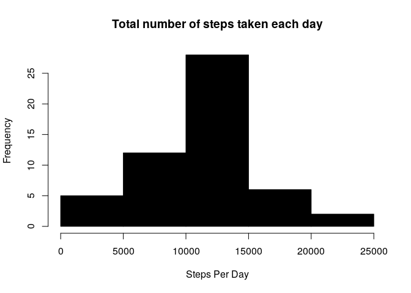
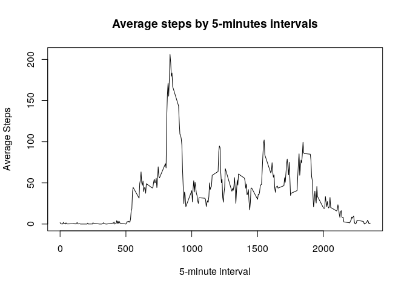
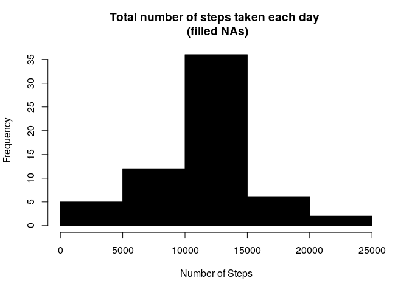
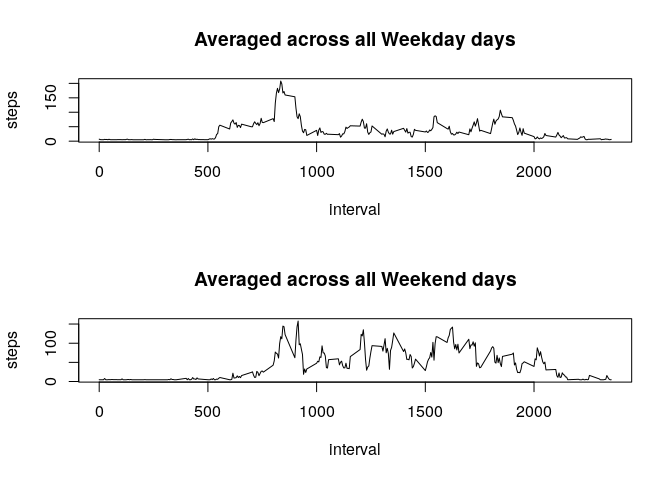

# Reproducible Research: Peer Assessment 1


## Loading and preprocessing the data


```r
unzip("activity.zip")
data <- read.csv("activity.csv", header=TRUE, sep=",")
data$date <- as.Date(as.character(data$date), "%Y-%m-%d")
```

## What is mean total number of steps taken per day?


```r
#Ignoring inputs with "NA". 
clean <- na.omit(data) 
sumaSteps <- aggregate(steps~date, clean, sum)
hist(sumaSteps$steps, col="black", main="Total number of steps taken each day", xlab="Steps Per Day")
```

<!-- -->

```r
meanSteps <- mean(sumaSteps$steps)
medianSteps <- median(sumaSteps$steps)
#This make output not so scientific
options(scipen=999)
```

Mean of the total number of steps taken per day is ``10766.1886792``.    
Median of the total number of steps taken per day is ``10765``.

## What is the average daily activity pattern?


```r
avgStep <- aggregate(steps~interval, clean, mean)
plot(avgStep$interval, avgStep$steps, type="l",
     xlab="5-minute interval", ylab="Average Steps",
     main="Average steps by 5-minutes intervals")
```

<!-- -->

```r
index <- which.max(avgStep$steps)
maxInterval <- avgStep[index, 'interval']
maxSteps <- avgStep[index, "steps"]
```

Across all the days in the dataset, the maximum number of steps is in the interval ``835`` with ``206.1698113`` steps.

## Imputing missing values


```r
NAs <- sum(is.na(data$steps))
```

``2304`` rows with "NA".


```r
dataFilled <- data
dataFilled[is.na(dataFilled)] <- mean(clean$steps)

sumStepsFilled <- aggregate(steps~date, dataFilled, sum)
hist(sumStepsFilled$steps, col="black", main="Total number of steps taken each day \n (filled NAs)", xlab="Number of Steps")
```

<!-- -->

```r
meanStepFilled = mean(sumStepsFilled$steps)
medianStepFilled = median(sumStepsFilled$steps)
```

Mean of the total number of steps taken per day is ``10766.1886792``.    
Median of the total number of steps taken per day is ``10766.1886792``.

The mean number of steps taken per day are the same before and after filled rows with "NA". But the median number of steps taken per day are slightly different. This is because we have filled rows that had "NA" with the general mean of steps.

## Are there differences in activity patterns between weekdays and weekends?


```r
par(mfrow=c(2,1))

dataFilled['dataType'] = factor(sapply(dataFilled$date, function(x){
  if (weekdays(x) == "sábado" | weekdays(x) == "domingo") { "weekend" } else { "weekday" } }))

#Weekdays
avgStepWeekday <- aggregate(steps ~ interval, data=subset(dataFilled, dataType=="weekday"), FUN=mean)
plot(avgStepWeekday, type="l", main="Averaged across all Weekday days")

#weekends
avgStepWeekend <- aggregate(steps ~ interval, data=subset(dataFilled, dataType=="weekend"), FUN=mean)
plot(avgStepWeekend, type="l", main="Averaged across all Weekend days")
```

<!-- -->
